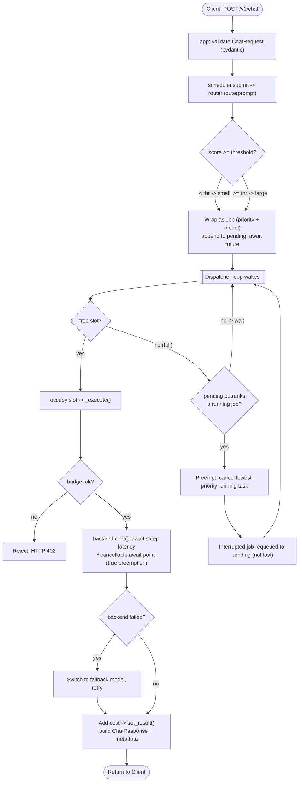

# llm-gateway

A lightweight, **mock-backed** LLM serving gateway built as a weekend project.
It demonstrates two ideas you'd want in a real inference gateway, in isolation
and without any GPU or API keys:

1. **Cost-aware routing** — a transparent complexity heuristic sends simple
   prompts to a cheap model and complex prompts to an expensive one.
2. **Priority scheduling with TRUE in-flight preemption** — high-priority
   requests interrupt already-running lower-priority work (which is requeued,
   not dropped), with a cumulative budget cap.

Everything is simulated: backends use `asyncio.sleep` for latency and a constant
`$/1k tokens` cost. **All benchmark numbers below are simulated** and produced by
this project's own mock backends. No real vendor, price, or model is referenced.

## Architecture

```
                 POST /v1/chat
        {prompt, priority, max_tokens}
                       │
                       ▼
          ┌───────────────────────────────────┐
          │              Router               │
          │  complexity score: length +       │
          │  keywords + code blocks  (0..1)   │
          │  thresholds in routing.yaml       │
          └────────────┬──────────────────────┘
                       │  score < thr  → small
                       │  score >= thr → large
                       │  error        → fallback tier
                       ▼
          ┌───────────────────────────────────┐
          │            Scheduler              │
          │  pending: HIGH > NORMAL > LOW     │
          │  dispatcher + 2 concurrent slots  │
          │  HIGH preempts LOW/NORMAL:        │
          │    cancel running Task, requeue   │
          │  budget cap (HTTP 402 on breach)  │
          └────────────┬──────────────────────┘
                       │
                       ▼
          ┌───────────────────────────────────┐
          │        Mock Backends (pool)       │
          │  small: cheap, fast               │
          │  large: expensive, slow           │
          │  OpenAI-compatible response       │
          │  asyncio.sleep simulated latency  │
          └────────────┬──────────────────────┘
                       │
                       ▼
          {content, metadata: model, cost_usd,
           latency_ms, queue_wait_ms, total_ms,
           preempted_count, used_fallback}
```

## Request flow

The full lifecycle of one request through router -> scheduler -> backend.
GitHub renders this Mermaid diagram automatically.



Two orthogonal decisions travel with each request: **priority** is supplied by
the caller (used by the scheduler to order and preempt), while **model** is
computed by the router from prompt complexity. They meet in the `Job` and never
interfere.

## Scheduling example

A concrete walk-through of priority + true preemption on `concurrency = 2`
(the two slots are the stand-in for GPU workers; latencies come from the mock
backends: `large = 80 + 1.6*tokens` ms, `small = 20 + 0.4*tokens` ms).

```
Tasks:
  A = LOW,  large, 200 tok  -> 400 ms   (arrives t=0)
  B = LOW,  large, 200 tok  -> 400 ms   (arrives t=0)
  C = HIGH, small,  50 tok  ->  40 ms   (arrives t=50)

Time (ms)   0    100  200  300  400  500
            +----+----+----+----+----+

(1) Priority + true preemption
  Slot 1    |AAAAAAAAAAAAAAAAAAAA|                 A: 0 -> 400
  Slot 2    |B-|CC|BBBBBBBBBBBBBBBBBBBB|           B: 0->50 (preempted),
               ^                                   C: 50->90, B restart: 90->490
               C (HIGH) arrives t=50, preempts B

(2) FCFS (no priority)
  Slot 1    |AAAAAAAAAAAAAAAAAAAA|                 A: 0 -> 400
  Slot 2    |BBBBBBBBBBBBBBBBBBBB|CC|              B: 0->400, then C: 400->440
                                 ^ C waits until a slot frees at t=400
```

**HIGH task C latency: 40 ms (preemption) vs 390 ms (FCFS).** The cost is that B
re-runs the 50 ms of work it lost to preemption (its `preempted_count` becomes
1). This is the single-example intuition behind the benchmark's p99 numbers.

## Quick start

```bash
make setup                                   # create .venv + install deps
make serve                                   # start API at http://127.0.0.1:8000
curl -s localhost:8000/v1/chat -H 'content-type: application/json' \
  -d '{"prompt":"Analyze and design a fault-tolerant system step by step","priority":"high","max_tokens":64}'
make test && make bench-readme               # run tests, then write benchmark numbers here
```

(No venv tooling? `python3 -m venv .venv && .venv/bin/pip install -r requirements.txt`,
then `.venv/bin/uvicorn llm_gateway.app:app`.)

## Benchmarks (simulated)

Regenerate with `make bench-readme` (runs `scripts/update_readme_benchmarks.py`).
All figures come from the mock backends and are deterministic (seeded).

### Routing — cost savings vs an all-large policy

<!-- ROUTING_BENCH:START -->
Workload: 500 requests, 40% complex (seed=1234). Routed to small: 455, large: 45.

| Policy | Total cost (USD) | Cost vs all-large |
|---|---:|---:|
| All-large (baseline) | $153.5400 | 100.0% |
| Cost-aware routing | $41.7168 | 27.2% |

**Cost savings: 72.8%** (simulated).
<!-- ROUTING_BENCH:END -->

### Scheduler — HIGH-tier tail latency, FCFS vs priority + preemption

<!-- SCHEDULER_BENCH:START -->
Workload: 48 LOW background jobs + 12 HIGH jobs, concurrency=2, speed_factor=0.1 (seed=7).

| Policy | HIGH p50 (ms) | HIGH p99 (ms) | HIGH mean (ms) | Preemptions |
|---|---:|---:|---:|---:|
| FCFS | 471.2 | 1057.2 | 623.5 | 0 |
| Priority + preemption | 4.5 | 4.8 | 4.3 | 10 |

**HIGH-tier p99 latency reduced by 99.5%** with priority + true preemption (simulated).
<!-- SCHEDULER_BENCH:END -->

## API

`POST /v1/chat`

```json
{ "prompt": "string", "priority": "high|normal|low", "max_tokens": 256, "model": "small|large (optional override)" }
```

Response includes the generated `content` plus `metadata`: the model used, the
model the router selected, the complexity score, token counts, simulated
`cost_usd`, `latency_ms` (service time), `queue_wait_ms`, `total_ms`,
`preempted_count`, and `used_fallback`. `GET /health` reports cumulative spend
and preemption count.

Tunables via env: `GATEWAY_CONCURRENCY` (default 2), `GATEWAY_BUDGET_USD`
(default none). Routing thresholds/keywords live in `config/routing.yaml`.

## Design decisions

**Why a single dispatcher + slots instead of N independent worker loops.**
True preemption requires comparing the best *pending* job against the *running*
jobs and interrupting the right one. A central dispatcher that owns the slots
makes that comparison trivial and race-free: on every wake-up it fills free
slots by priority, then, if a pending job outranks a running job, it cancels the
lowest-priority running Task. Independent workers pulling from a queue can
reorder *future* work but cannot interrupt *current* work.

**Why preemption restarts rather than checkpoints.** A real model call has no
resumable state here, so an interrupted request is cancelled and **requeued**
from scratch (its `preempted_count` is tracked so the cost is visible). Because
backend latency is an awaited `asyncio.sleep`, cancellation actually interrupts
in-flight work — this is genuine preemption, not queue reordering.

**Why a heuristic router, not a model.** Cost-aware routing only needs to be
*directionally* right and, above all, explainable and configurable. The score
combines prompt length (saturating), reasoning keywords (capped), and code-block
presence; the threshold and weights are YAML-tunable. A simulated backend
failure triggers a fallback to the other tier.

**Why mock backends.** The goal is to study routing and scheduling behavior, not
model quality. Mocks make latency, cost, and failures deterministic and free,
so benchmarks are reproducible and contain zero real-world data.

**Budget cap.** The scheduler tracks cumulative simulated spend and rejects a
request (HTTP 402) when its estimated cost would exceed `GATEWAY_BUDGET_USD`.

## Project layout

```
llm-gateway/
├── config/routing.yaml          # thresholds, weights, keywords, fallback
├── llm_gateway/
│   ├── models.py                # pydantic request/response + OpenAI-compatible shapes
│   ├── backends.py              # MockBackend small/large + BackendPool
│   ├── router.py                # complexity scoring + model selection + fallback
│   ├── scheduler.py             # priority queues + 2 slots + TRUE preemption + budget
│   └── app.py                   # FastAPI /v1/chat, /health
├── benchmarks/                  # routing_benchmark, scheduler_benchmark
├── scripts/update_readme_benchmarks.py
└── tests/                       # router, scheduler (asserts preemption), api
```

## License

MIT. This is an independent, public, educational project; all data is simulated.
